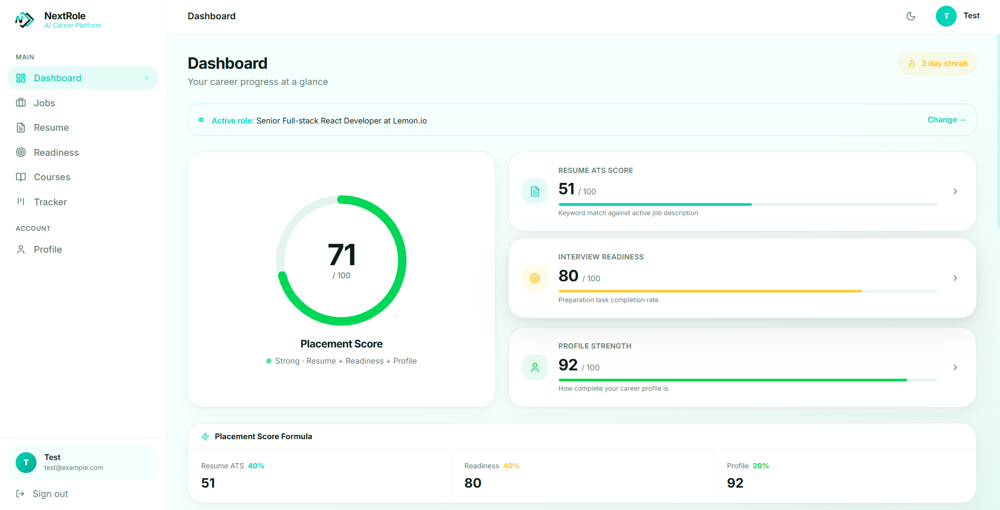
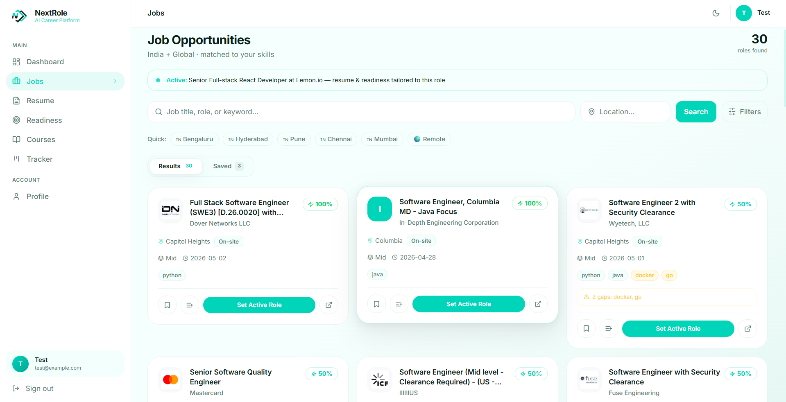
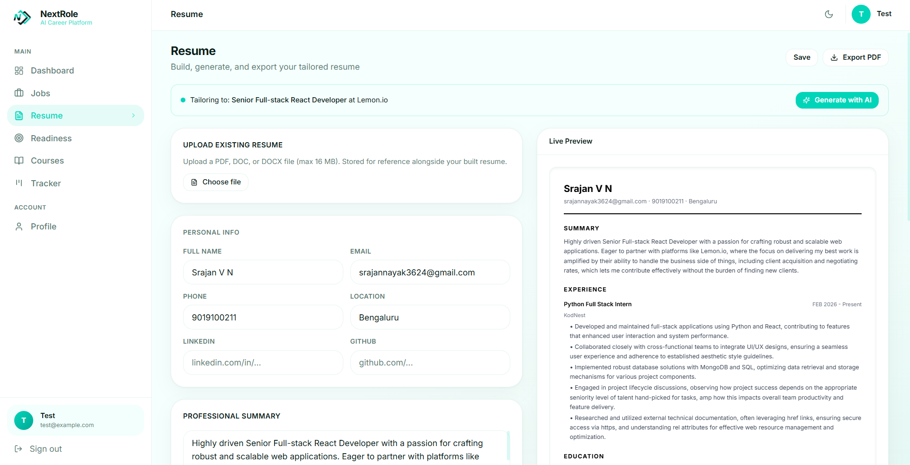
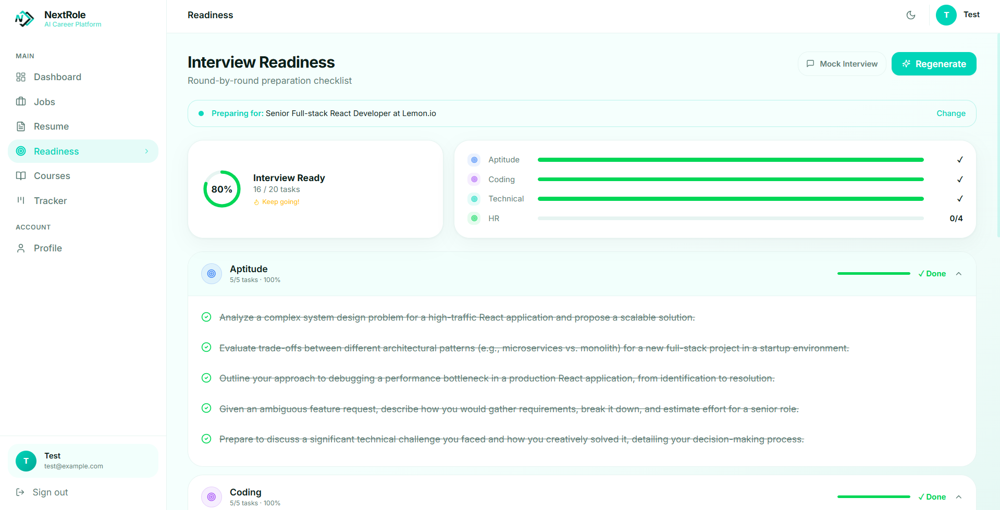
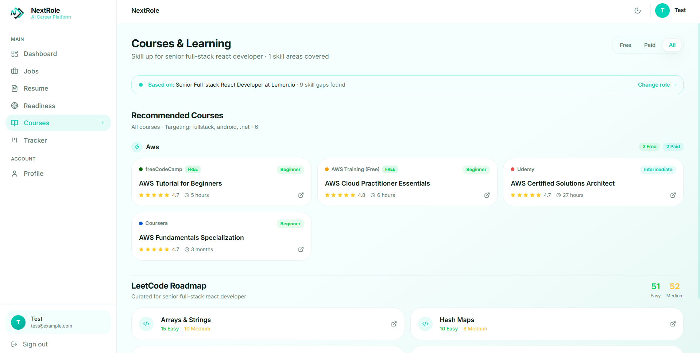
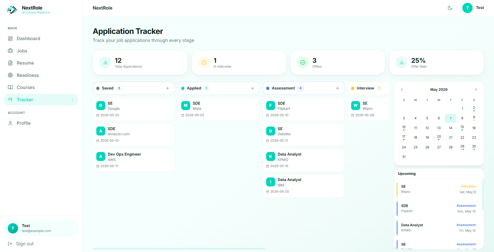
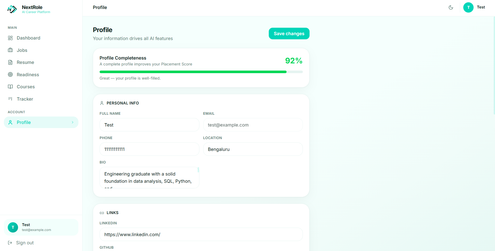

# NextRole — AI Career Platform


NextRole is an AI-powered career intelligence platform that unifies resume optimization, ATS analysis, interview preparation, job discovery, skill-gap analysis, learning recommendations, and application tracking into a single placement-readiness system.

---

## Overview

Traditional career preparation tools solve isolated problems — resume building, interview prep, or job discovery — separately. NextRole unifies the entire placement journey into one integrated ecosystem.

The platform helps users understand:

- Where they currently stand
- What skills they are missing
- Which jobs match their profile
- How prepared they are for interviews
- What actions they should take next

Core capabilities:

- Resume Intelligence and ATS Optimization
- Placement Analytics and Readiness Scoring
- AI-Powered Interview Preparation
- Multi-Source Job Discovery
- Skill-Gap Analysis and Learning Recommendations
- Application Pipeline Tracking
- LinkedIn Profile Optimization

---

## Tech Stack

### Frontend

- React 18
- Vite
- Tailwind CSS
- Framer Motion
- React Router DOM
- Axios
- Lucide React
- react-to-print

### Backend

- Python Flask
- Flask-JWT-Extended
- Flask-CORS
- bcrypt
- google-generativeai
- pdfplumber
- python-docx
- requests
- python-dotenv

### Database

- MongoDB
- PyMongo

### AI and Job APIs

- Google Gemini 2.5 Flash
- JSearch (RapidAPI)
- Adzuna
- Remotive

---

## Project Structure

```
NextRole/
├── backend/
│   ├── app/
│   │   ├── routes/
│   │   │   ├── auth.py
│   │   │   ├── courses.py
│   │   │   ├── dashboard.py
│   │   │   ├── interview.py
│   │   │   ├── jobs.py
│   │   │   ├── linkedin.py
│   │   │   ├── profile.py
│   │   │   ├── readiness.py
│   │   │   ├── resume.py
│   │   │   └── tracker.py
│   │   ├── services/
│   │   │   ├── gemini_service.py
│   │   │   ├── rapidapi_service.py
│   │   │   └── scoring_service.py
│   │   ├── utils/
│   │   │   └── auth_helpers.py
│   │   ├── __init__.py
│   │   └── config.py
│   ├── .env.example
│   ├── requirements.txt
│   └── run.py
├── frontend/
│   ├── public/
│   ├── src/
│   │   ├── components/
│   │   │   ├── common/
│   │   │   │   ├── Badge.jsx
│   │   │   │   ├── Button.jsx
│   │   │   │   ├── Card.jsx
│   │   │   │   ├── EmptyState.jsx
│   │   │   │   ├── Input.jsx
│   │   │   │   ├── PageWrapper.jsx
│   │   │   │   ├── ProgressBar.jsx
│   │   │   │   └── SkeletonCard.jsx
│   │   │   └── layout/
│   │   │       ├── AppShell.jsx
│   │   │       ├── Sidebar.jsx
│   │   │       ├── ThemeToggle.jsx
│   │   │       └── Topbar.jsx
│   │   ├── context/
│   │   │   ├── AppContext.jsx
│   │   │   └── AuthContext.jsx
│   │   ├── hooks/
│   │   │   ├── useCountUp.js
│   │   │   └── useTheme.js
│   │   ├── pages/
│   │   │   ├── Courses.jsx
│   │   │   ├── Dashboard.jsx
│   │   │   ├── Jobs.jsx
│   │   │   ├── Landing.jsx
│   │   │   ├── Login.jsx
│   │   │   ├── Profile.jsx
│   │   │   ├── Readiness.jsx
│   │   │   ├── Resume.jsx
│   │   │   ├── Signup.jsx
│   │   │   └── Tracker.jsx
│   │   ├── services/
│   │   │   └── api.js
│   │   ├── App.jsx
│   │   ├── index.css
│   │   └── main.jsx
│   ├── .env.example
│   ├── index.html
│   ├── package.json
│   ├── tailwind.config.js
│   └── vite.config.js
├── screenshots/
└── README.md
```

---

## Installation Guide

### Prerequisites

- Python 3.8+
- Node.js 18+
- MongoDB 6+

### 1. Clone Repository

```bash
git clone https://github.com/Srajan-V-N/NextRole.git
cd NextRole
```

### 2. Backend Setup

```bash
cd backend
python -m venv venv
```

Activate the virtual environment:

**Windows**
```bash
venv\Scripts\activate
```

**Linux / macOS**
```bash
source venv/bin/activate
```

Install dependencies and start the server:

```bash
pip install -r requirements.txt
python run.py
```

Backend runs at `http://localhost:5000`.

### 3. Frontend Setup

```bash
cd frontend
npm install
npm run dev
```

Frontend runs at `http://localhost:5173`.

---

## Environment Variables

### Backend — `backend/.env`

Copy `backend/.env.example` and fill in the values:

```env
MONGO_URI=mongodb://localhost:27017/nextrole
JWT_SECRET=your_jwt_secret_key

GEMINI_API_KEY=your_gemini_api_key

RAPIDAPI_KEY=your_rapidapi_key
RAPIDAPI_HOST=jsearch.p.rapidapi.com

ADZUNA_APP_ID=your_adzuna_app_id
ADZUNA_APP_KEY=your_adzuna_app_key

FLASK_ENV=development
CORS_ORIGIN=http://localhost:5173
```

Only `MONGO_URI` and `JWT_SECRET` are required to run the application. All job API keys are optional. `GEMINI_API_KEY` is required only for AI-powered features (resume generation, interview prep, LinkedIn optimization).

### Frontend — `frontend/.env`

```env
VITE_API_BASE_URL=http://localhost:5000/api
```

---

## Modules

### Dashboard — Placement Intelligence System



<p align="center"><b>Figure 1:</b> Dashboard displaying placement analytics, active role context, placement score calculation, and career progress metrics.</p>

The dashboard acts as the central intelligence hub of the platform. All metrics update dynamically based on the **Active Role** selected from the Jobs module.

#### Placement Score

A unified score representing overall placement readiness.

```
Placement Score = (0.4 × Resume ATS Score) + (0.4 × Interview Readiness) + (0.2 × Profile Strength)
```

#### Component Scores

| Score               | What It Measures                                                                          |
|---------------------|-------------------------------------------------------------------------------------------|
| Resume ATS Score    | Keyword match between resume and active job description.                                  |
| Interview Readiness | Preparation progress across interview categories.                                         |
| Profile Strength    | Profile completeness across personal info, skills, experience, education, links, and bio. |

Additional dashboard panels:

- Placement formula breakdown
- Weekly activity streak tracking
- Skill gap summary for the active role
- Application pipeline overview
- Recent activity feed

---

### Jobs — Smart Career Discovery Engine



<p align="center"><b>Figure 2:</b> Job discovery module showing intelligent matching, company logos, role analytics, filters, and active role selection.</p>

The Jobs module aggregates listings from JSearch, Adzuna, and Remotive.

#### Job Card Information

Each card displays:

- Company logo
- Role title and organization
- Location and work mode
- Experience level
- Posting date
- Skill tags
- Match percentage against the user's profile
- Missing skill indicators

#### Search and Filtering

Filters available:

- Location, work mode, experience level
- Job type and salary range
- Company name
- Region (India / Global)

Quick-filter presets: Bengaluru, Hyderabad, Pune, Chennai, Mumbai, Remote.

#### Active Role System

Setting a job as the **Active Role** propagates context across the entire platform:

- Resume generation and ATS analysis
- Interview readiness checklist
- Course and LeetCode recommendations
- Dashboard analytics

---

### Resume — AI Resume Intelligence System



<p align="center"><b>Figure 3:</b> Resume module showing upload support, resume builder, AI generation, and live preview.</p>

#### Resume Upload

Accepted formats: PDF, DOC, DOCX. Uploaded files are parsed by Gemini to pre-populate the resume form.

#### Resume Builder

Editable sections:

- Personal information and contact details
- LinkedIn and GitHub links
- Professional summary
- Experience and projects
- Skills and education
- Certifications

#### AI Resume Generation

When an Active Role is set, Gemini generates a role-targeted resume that:

- Writes an optimized professional summary
- Improves experience bullet points
- Reorders and categorizes skills
- Prioritizes relevant projects
- Weaves missing ATS keywords naturally into content

Default section order:

```
Summary → Experience → Projects → Skills → Education → Certifications
```

#### ATS Score Panel

Displays keyword match score (0–100), matched keywords, and missing keywords. Missing keywords are hidden after AI generation.

#### Live Preview and Export

The right panel renders the resume in real time. Users can export a recruiter-ready PDF via the print dialog.

---

### Readiness — Interview Preparation System



<p align="center"><b>Figure 4:</b> Interview readiness module showing preparation categories, completion analytics, and AI-generated tasks.</p>

#### Preparation Categories

| Category  | Task Count |
|-----------|------------|
| Aptitude  |      5     |
| Coding    |      5     |
| Technical |      6     |
| HR        |      4     |

All tasks are generated by Gemini and tailored to the active job role and description.

#### Readiness Score

```
Readiness Score = (Completed Tasks / Total Tasks) × 100
```

#### Features

- Check and uncheck tasks to update the score in real time
- Regenerate the preparation plan for a different active role
- Launch a **Mock Interview** modal that generates technical, behavioral, and HR questions with tips for each

---

### Courses — Skill Intelligence and Learning System



<p align="center"><b>Figure 5:</b> Learning recommendation engine showing skill-gap driven course recommendations and a LeetCode roadmap.</p>

The Courses module compares job requirements against the user's skill set and surfaces targeted learning content.

#### Recommended Courses

Courses are grouped by missing skill. Each card contains:

- Platform name (Coursera, Udemy, freeCodeCamp, AWS Learning, and others)
- Difficulty level
- Estimated duration
- Rating
- External link

Users can filter by Free, Paid, or All courses.

#### LeetCode Roadmap

Problem categories and difficulty breakdowns (Easy / Medium) are recommended based on the active job role. All entries link directly to LeetCode.

---

### Tracker — Application Workflow Management



<p align="center"><b>Figure 6:</b> Application tracker showing kanban workflow, interview calendar, and upcoming events.</p>

#### Application Pipeline

Applications move through six stages:

```
Saved → Applied → Assessment → Interview → Offer → Rejected
```

Each card stores the role, company, dates, stage, and notes.

#### Calendar Panel

The right sidebar displays a mini calendar with:

- Interview dates and assessment schedules
- Offer deadlines
- Upcoming event list with date and type

#### Statistics

Displayed at the top: total applications, interviews count, offer count, and offer rate percentage.

---

### Profile — Career Identity Management



<p align="center"><b>Figure 7:</b> Profile management module storing career information, profile analytics, and LinkedIn optimization.</p>

The Profile module is the data source for all AI and scoring features across the platform.

#### Stored Information

- Personal info: name, email, phone, location, bio
- Career links: LinkedIn, GitHub, portfolio
- Skills, experience, and education

#### Profile Strength

```
Profile Strength contributes 20% to the overall Placement Score
```

Completeness is measured across personal info, skills, experience, education, links, and bio.

#### LinkedIn Profile Optimizer

Powered by Gemini. Users enter a target role (or use the active job) to generate:

- An optimized LinkedIn headline
- A 300-word LinkedIn summary
- 8 relevant keywords for profile discoverability

Each output section has a copy button for direct use.

---

## AI Features

All AI features use the **Gemini 2.5 Flash** model.

### Resume Parsing

Uploaded PDF, DOC, or DOCX resumes are parsed to extract name, email, phone, location, LinkedIn, GitHub, summary, skills, experience, and education — pre-populating the resume form automatically.

### AI Resume Generation

Generates ATS-optimized, role-specific resume content: summary, improved bullet points, reordered and categorized skills, and prioritized projects targeted at the active job description.

### Skill Gap Intelligence

Compares job requirements against user skills to produce a list of missing skills, targeted course recommendations, and a LeetCode problem roadmap.

### Interview Preparation

Generates a tailored preparation checklist across Aptitude, Coding, Technical, and HR categories based on the active job title and description.

### Mock Interviews

Generates 5 technical questions, 5 behavioral questions, and 5 HR questions — each with a preparation tip — presented in a tabbed modal on the Readiness page.

### LinkedIn Profile Optimization

Generates an optimized LinkedIn headline, a professional summary, and a keyword list for profile discoverability, targeted to a specified or active job role.

---

## Future Enhancements

- AI Career Coach
- Referral Intelligence
- Interview Simulation
- Resume Versioning
- Email Reminders for application deadlines
- Placement Forecasting
- Recruiter Portal
- Career Trajectory Predictions

---

## Conclusion

NextRole integrates:

- Resume Intelligence
- ATS Optimization
- Interview Preparation
- Skill Gap Analysis
- Learning Recommendations
- Application Tracking
- Career Analytics
- AI Guidance

into one unified placement ecosystem.

The platform focuses not only on helping users find jobs but helping them become placement-ready through intelligent analytics, AI assistance, and structured preparation workflows.
